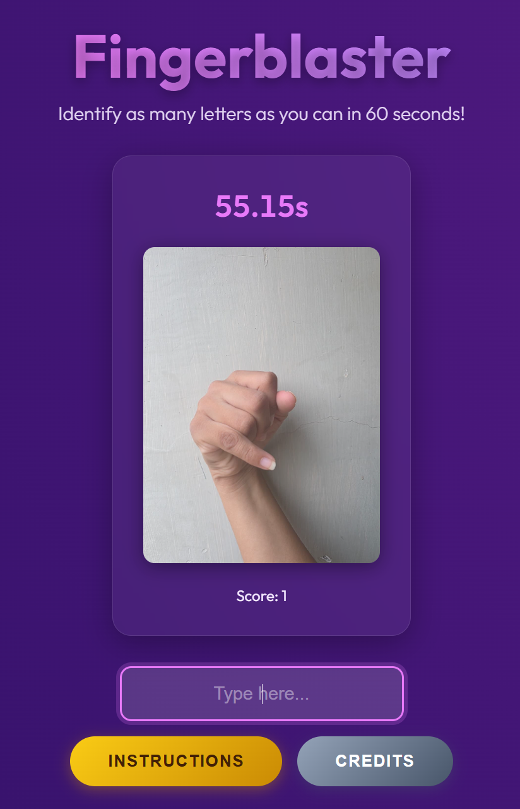

# Fingerblaster

A project that's designed to help you learn the ASL alphabet through a silly little reaction time game. This is my final project for CSDS221

## Credits
- ASL Image Dataset from [Shreya Godhani](https://www.kaggle.com/datasets/shreyagodhani645/asl-hand-alphabet-dataset)
- ASL Alphabet from [Tetiana Bihus](https://www.vecteezy.com/members/tetianabihus2171285)